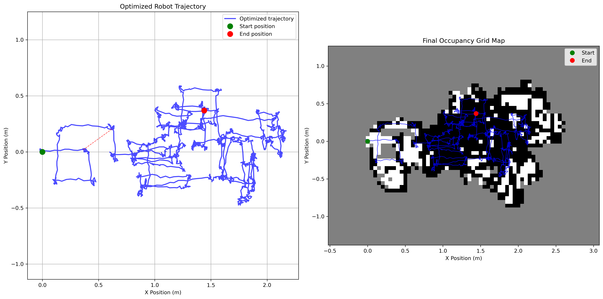

# RoboEx - Robotics Experimental Platform

A comprehensive robotics research platform implementing sensor modeling, motion analysis, and Graph Optimization SLAM from scratch. This project provides a complete pipeline for mobile robot localization and mapping using IMU and LiDAR sensor data.

## 🚀 Features

### Core Implementations
- **LiDAR Sensor Model**: Calibration and error characterization with bias/variance analysis
- **Robot Motion Model**: Odometry drift analysis and systematic error modeling  
- **Graph Optimization SLAM**: Custom implementation without external SLAM libraries
- **Loop Closure Detection**: Automatic detection and optimization of revisited locations
- **Occupancy Grid Mapping**: Real-time map construction from sensor data

### Advanced Visualizations
- **Interactive 2D Dashboards**: Plotly-based sensor analysis and trajectory visualization
- **3D Trajectory Plots**: Enhanced spatial understanding of robot motion
- **Real-time Animation**: Robot movement visualization with GIF generation
- **Statistical Analysis**: Comprehensive error analysis and model validation

## 📊 Project Overview

This project addresses three fundamental robotics challenges:

1. **Sensor Modeling**: Extract and characterize LiDAR sensor noise and bias patterns
2. **Motion Modeling**: Analyze odometry drift and systematic errors in robot movement  
3. **SLAM Implementation**: Perform simultaneous localization and mapping using graph optimization

The robot is equipped with:
- IMU sensors (100 Hz) for position estimation (x, y, θ)
- LiDAR sensor (10 Hz) for distance measurements to walls
- Differential drive system for controlled movement

## 🎬 Visual Results

### Robot Animation


*Real-time visualization of robot trajectory during maze navigation with SLAM optimization*

### Key Visualizations

#### LiDAR Sensor Calibration


*Sensor bias and variance analysis across different distances*

#### Motion Model Analysis


*Robot motion statistics and odometry drift analysis*

#### SLAM Results


*Complete SLAM results showing optimized trajectory and occupancy grid map*

#### Comprehensive Error Analysis


*System-wide error analysis across all components*

## 🛠️ Installation

### Prerequisites
- Python 3.7+
- Required packages listed in `requirements.txt`

### Setup

#### Local Installation
```bash
# Clone or download the project
cd roboex

# Install dependencies
pip install -r requirements.txt

# Verify installation
python main.py
```

#### Google Colab Usage
```python
# Upload the project folder to Colab or clone from repository
# Install dependencies
!pip install -r requirements.txt

# Run the complete pipeline
!python main.py

# Or run individual components
!python "Sensor Model/sensor_model.py"
!python "Motion Model/motion_model.py" 
!python "SLAM/graph_optimization_slam.py"
```

### Dependencies
```
numpy>=1.19.0
pandas>=1.3.0
matplotlib>=3.3.0
plotly>=5.0.0
seaborn>=0.11.0
```

## 📁 Project Structure

```
roboex/
├── main.py                           # Main execution pipeline
├── requirements.txt                  # Python dependencies
├── data/                            # Experimental datasets
│   ├── calibration/
│   │   ├── lidar/                   # LiDAR calibration at known distances
│   │   │   ├── distance_10.csv      # Measurements at 10cm
│   │   │   ├── distance_15.csv      # Measurements at 15cm
│   │   │   └── ...                  # Additional distance measurements
│   │   └── motion/
│   │       └── odom_data.csv        # Square path odometry data
│   └── maze/
│       ├── odom_data.csv            # Maze navigation odometry
│       └── range_data.csv           # Distance-to-wall measurements
├── Sensor Model/
│   ├── sensor_model.py              # LiDAR sensor modeling implementation
│   ├── lidar_calibration.png        # Calibration results
│   └── interactive_sensor_analysis.html
├── Motion Model/
│   ├── motion_model.py              # Robot motion analysis
│   ├── motion_analysis.png          # Motion statistics
│   └── interactive_motion_3d.html
├── SLAM/
│   ├── graph_optimization_slam.py   # Graph-based SLAM implementation
│   ├── final_results.png            # SLAM results
│   └── interactive_slam_dashboard.html
├── enhanced_visualizations.py       # 2D interactive visualizations
├── enhanced_visualizations_3d.py    # 3D visualizations
├── robot_animation.py              # Animation generation
└── README.md                       # This file
```

## 🚀 Usage

### Quick Start
```bash
# Run complete pipeline
python main.py
```

### Individual Components
```python
# Run sensor model extraction only
from Sensor_Model.sensor_model import run_sensor_model_extraction
sensor_model = run_sensor_model_extraction('data/')

# Run motion model extraction only  
from Motion_Model.motion_model import run_motion_model_extraction
motion_model = run_motion_model_extraction('data/')

# Run SLAM only
from SLAM.graph_optimization_slam import run_graph_optimization_slam
slam = run_graph_optimization_slam('data/', sensor_model, motion_model)
```

## 📈 Experimental Data

### LiDAR Calibration Dataset
- **Purpose**: Sensor error characterization
- **Setup**: Robot positioned at known distances (10-37cm) from wall
- **Data**: ~500 measurements per distance, 7 different distances
- **Analysis**: Bias and variance modeling for sensor correction

### Motion Calibration Dataset  
- **Purpose**: Odometry drift analysis
- **Setup**: 1m × 1m square path, 8 complete circuits (4 clockwise, 4 counterclockwise)
- **Data**: ~30,000 measurements at 100Hz
- **Analysis**: Systematic error detection and wheel encoder calibration

### SLAM Validation Dataset
- **Purpose**: Real-world SLAM algorithm testing
- **Setup**: Maze navigation with multiple loop closures
- **Data**: ~56,000 odometry + ~4,400 range measurements
- **Analysis**: Map construction and trajectory optimization

## 📊 Output Files

### Standard Visualizations
- `Sensor Model/lidar_calibration.png` - Sensor calibration results
- `Motion Model/motion_analysis.png` - Motion statistics and drift analysis
- `SLAM/final_results.png` - Complete SLAM results with optimized trajectory
- `comprehensive_error_analysis.png` - Overall system error analysis

### Interactive Visualizations
- `Sensor Model/interactive_sensor_analysis.html` - Interactive sensor dashboard
- `Motion Model/interactive_motion_3d.html` - 3D motion analysis
- `SLAM/interactive_slam_dashboard.html` - Complete SLAM visualization
- `error_analysis_3d.html` - 3D error analysis dashboard

### Animations
- `robot_animation.gif` - Robot trajectory animation
- `robot_simple.gif` - Simplified movement visualization

## 🔬 Technical Implementation

### Sensor Model
- **Bias Estimation**: Linear regression for systematic error correction
- **Noise Characterization**: Statistical analysis of measurement variance
- **Calibration Function**: Distance-dependent correction factors

### Motion Model  
- **Drift Analysis**: Cumulative error tracking over known paths
- **Covariance Estimation**: Process noise modeling for Kalman filtering
- **Systematic Error Detection**: Identification of wheel encoder biases

### SLAM Algorithm
- **Graph Construction**: Pose nodes connected by odometry and loop closure edges
- **Information Matrices**: Uncertainty weighting for optimization
- **Loop Closure Detection**: Threshold-based revisit identification
- **Optimization**: Iterative least-squares minimization of pose graph error

## 🎯 Key Results

### Sensor Characterization
- LiDAR bias: ~0.02m systematic offset
- Measurement variance: Distance-dependent noise model
- Calibration accuracy: Sub-centimeter precision after correction

### Motion Analysis
- Odometry drift: ~2% cumulative error over 8m path
- Angular bias: Consistent turning error of ~0.5°
- Process noise: Characterized for optimal filter tuning

### SLAM Performance
- Map accuracy: Consistent wall detection and mapping
- Loop closure: Successful detection and correction of drift
- Trajectory optimization: Significant improvement over raw odometry

## 🔧 Customization

### Adding New Sensors
1. Implement sensor model in `Sensor Model/` directory
2. Add calibration data processing
3. Update main pipeline in `main.py`

### Modifying SLAM Algorithm
1. Edit `SLAM/graph_optimization_slam.py`
2. Implement custom optimization methods
3. Add new constraint types or information matrices

### Enhanced Visualizations
1. Modify `enhanced_visualizations.py` for 2D plots
2. Edit `enhanced_visualizations_3d.py` for 3D visualizations
3. Add custom analysis in respective model directories

## 🤝 Contributing

This is a research project implementing fundamental robotics algorithms from scratch. Key implementation principles:

- **No External SLAM Libraries**: All algorithms implemented manually
- **Educational Focus**: Clear, well-documented code for learning
- **Modular Design**: Independent sensor, motion, and SLAM components
- **Comprehensive Testing**: Multiple validation datasets and visualizations

## 📄 License

This project is for educational and research purposes at the University of Tehran. Please cite appropriately if used in academic work.

## 🔗 References

- Graph-based SLAM optimization techniques
- Sensor calibration and error modeling methods
- Mobile robot localization and mapping algorithms

---

*Generated by RoboEx SLAM Pipeline - Ali Mikaeili*
